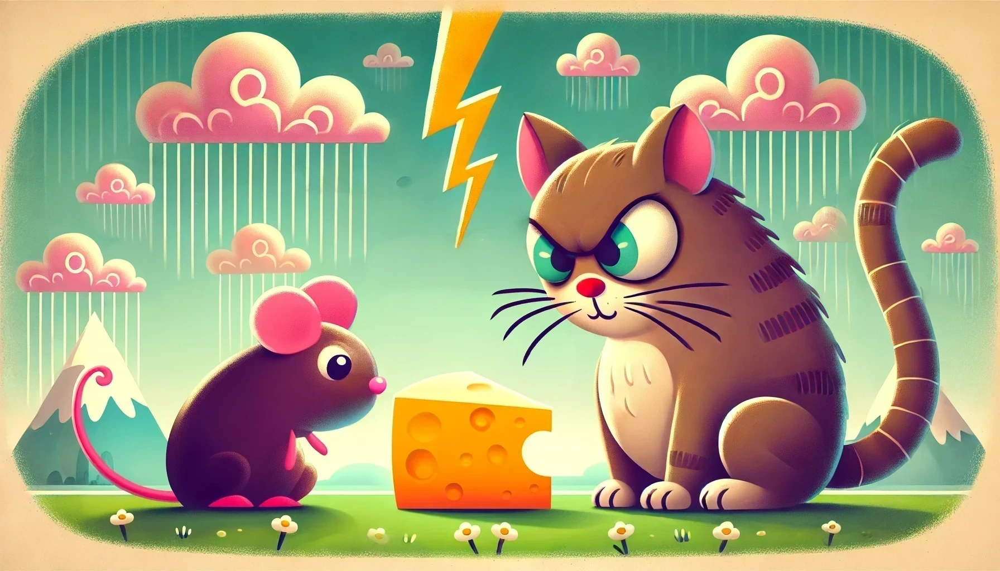

<p align="center">
  
</p>

# Cat-Mouse Markov Game

A grid-based reinforcement learning markov game where a **cat** chases a **mouse**, while the mouse aims to reach **cheese**. The game uses **Q-learning** for agent strategy development, balancing exploration and exploitation, and is optimized using **Ray Tune**.

## Game Mechanics

### Environment
- **Grid Size**: 11x11 grid.
- **Agents**:
  - **Cat**: Attempts to catch the mouse. Is randomly repositioned each episode.
  - **Mouse**: Aims to collect cheese while avoiding the cat. Is randomly repositioned each episode.
- **Cheese**: Fixed at `(0, 10)` and `(10, 10)`.

### Agents
- **Q-Learning** is used for both agents with reward-based strategies:
  - **Cat**:
    - Rewards for catching the mouse.
    - Penalties for invalid moves.
  - **Mouse**:
    - Rewards for reaching cheese and avoiding the cat.
    - Penalties for being caught.

## Balancing
The reward structure is designed to achieve a **50/50 win rate** over time, ensuring both agents have equal chances of success.

## Execution
1. Install dependencies:
   ```bash
   pip install -r requirements.txt
   ```
2. Update Ray Tune temp directory if needed:
   ```python
   ray.init(_temp_dir="C:/ray_temp", ignore_reinit_error=True)
   ```
3. Run the game:
   ```bash
   python Cat_Mouse_Markov_Game.py
   ```
Or open the Jupyter Notebook.

## Demo

<p align="center">
  
</p>

## Notes
<p align="center">
  
</p>