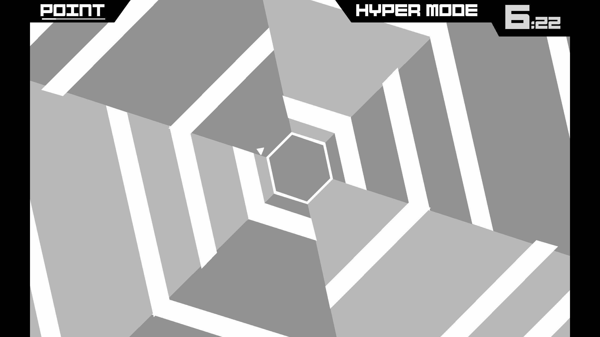

# AI5199 - Reinforcement Learning Projects

Welcome to the repository for various reinforcement learning (RL) projects completed as part of the **AI5199 - Reinforcement Learning** module at Fulda University of Applied Sciences during the winter semester of 2024/2025. These projects demonstrate fundamental RL concepts through practical implementations and are designed to aid understanding of key algorithms and their applications.

The projects within this repository were developed by the following team members from the **"Group One"** group, each contributing to the reinforcement learning projects:

- **Lucas Immanuel Nickel**  
- **Nick Stolbov**  
- **Georg Haar**  

## Project List

### Cat Mouse Markov Game

- **Description**: A grid-based RL game where a cat chases a mouse, and the mouse aims to reach cheese. Uses Q-learning for strategy optimization, enhanced with Ray Tune.
- **Algorithm**: Q-Learning  
- **Date**: December 9, 2024  
- **Link**: [Cat Mouse Markov Game](./Cat_Mouse_Markov_Game)

### Super Hexagon Agent

- **Description**: An agent trained to play *Super Hexagon* by leveraging Policy Gradient methods for decision-making and continuous action optimization. This project integrates OpenGL hooks and memory injection to interface directly with the game and extract relevant states for reinforcement learning.
- **Algorithm**: Policy-Grading  
- **Date**: *TBA*  
- **Link**: [Super Hexagon Agent](./Super_Hexagon_Agent)
  
